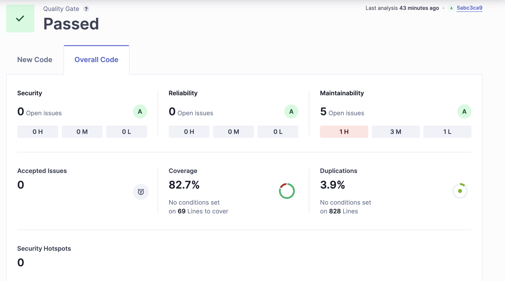

## My NY Times

### Description

This project is a web application that fetches and displays articles from the New York Times Most Popular API. Users can view popular articles and see detailed information about each article.

### Installation

1. Clone the repository:
   ```
   git clone <repository-url>
   ```
2. Navigate to the project directory:
   ```
   cd my-ny-times
   ```
3. Install dependencies:
   ```
   npm install
   ```

### Usage

To start the development server, run:

```
npm start
```

This will start the application and open it in your default web browser.

### Scripts

- `start`: Starts the development server.
- `build`: Builds the application for production.
- `test`: Runs tests using Jest.
- `eject`: Ejects the application from Create React App.
- `lint`: Lints JavaScript files.
- `lint: fix`: Runs JavaScript linting.
- `coverage`: Runs tests with coverage report.
- `sonarqube`: Runs linting, tests with coverage, and sends results to SonarQube for analysis.
- `cypress`: Runs Cypress tests.

### Sonar Report


